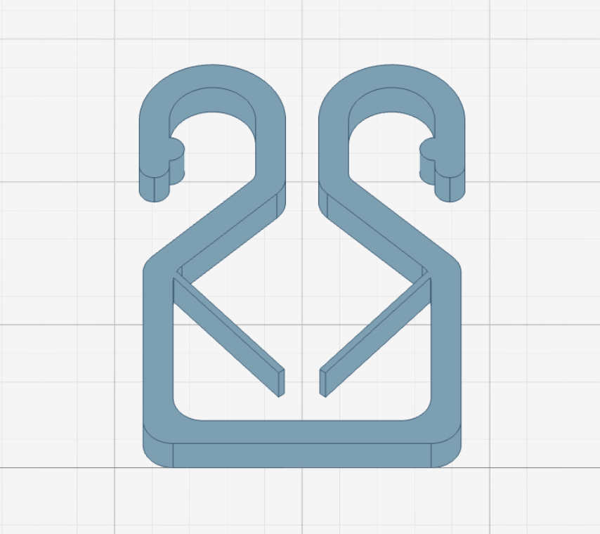

# Ski Holder Designer

A parametric 3D ski holder designer that lets you customize and download STL files for 3D printing. Built with [replicad](https://replicad.xyz) and React.

## Try it out

https://jehna.github.io/ski-holder/

## Bug? Need a better version?

There's a [better source I did with OnShape][onshape], and this is a partial
port of that model, mostly since RepliCAD does not support constraints.

[onshape]: https://cad.onshape.com/documents/2d25217b419c06d7cedb2dfa/w/ce721df0d79edc59504dfeaf/e/8ecfbe3c99ccae5bbf9d4c31?configuration=List_tuc2VfkKfYmdpU%3DDefault&renderMode=0&uiState=6962f207dbb301f24f3c1111

## License

This project is licensed with MIT license
